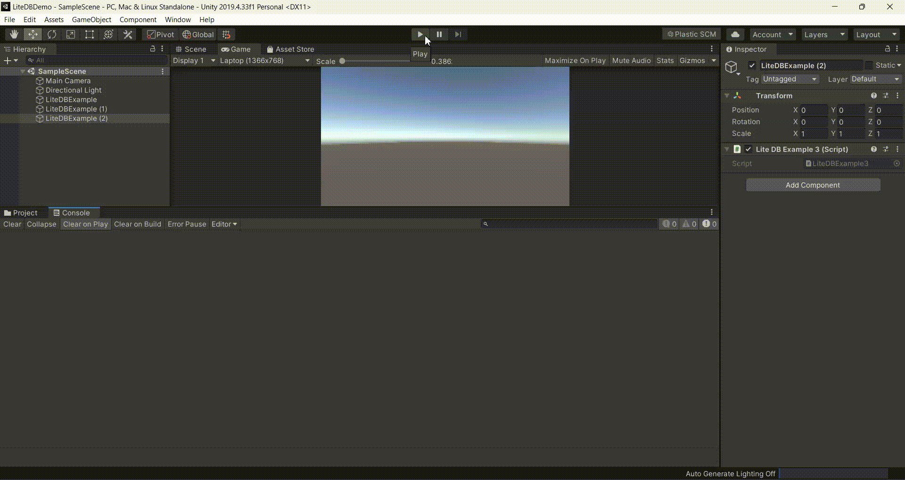

# LiteDB - A .NET NoSQL Document Store in a single data file
LiteDB is a small, fast and lightweight .NET NoSQL embedded database. 



- Serverless NoSQL Document Store
- Simple API, similar to MongoDB
- 100% C# code for .NET 4.5 / NETStandard 1.3/2.0 in a single DLL (less than 450kb)
- Thread-safe
- ACID with full transaction support
- Data recovery after write failure (WAL log file)
- Datafile encryption using DES (AES) cryptography
- Map your POCO classes to `BsonDocument` using attributes or fluent mapper API
- Store files and stream data (like GridFS in MongoDB)
- Single data file storage (like SQLite)
- Index document fields for fast search
- LINQ support for queries
- SQL-Like commands to access/transform data
- [LiteDB Studio](https://github.com/mbdavid/LiteDB.Studio) - Nice UI for data access 
- Open source and free for everyone - including commercial use
- Install from NuGet: `Install-Package LiteDB`

## Documentation

Visit [the Wiki](https://github.com/mbdavid/LiteDB/wiki) for full documentation. For simplified chinese version, [check here](https://github.com/lidanger/LiteDB.wiki_Translation_zh-cn).


## How to use LiteDB

A quick example for storing and searching documents:

```C#
// Create your POCO class
public class Customer
{
    public int Id { get; set; }
    public string Name { get; set; }
    public int Age { get; set; }
    public string[] Phones { get; set; }
    public bool IsActive { get; set; }
}

// Open database (or create if doesn't exist)
using(var db = new LiteDatabase(@"MyData.db"))
{
    // Get customer collection
    var col = db.GetCollection<Customer>("customers");

    // Create your new customer instance
    var customer = new Customer
    { 
        Name = "Vishnu", 
        Phones = new string[] { "8000-0000", "9000-0000" }, 
        Age = 39,
        IsActive = true
    };

    // Create unique index in Name field
    col.EnsureIndex(x => x.Name, true);

    // Insert new customer document (Id will be auto-incremented)
    col.Insert(customer);

    // Update a document inside a collection
    customer.Name = "Vishnu Sivan";

    col.Update(customer);

    // Use LINQ to query documents (with no index)
    var results = col.Find(x => x.Age > 20);
}
```

Using fluent mapper and cross document reference for more complex data models

```C#
// DbRef to cross references
public class Order
{
    public ObjectId Id { get; set; }
    public DateTime OrderDate { get; set; }
    public Address ShippingAddress { get; set; }
    public Customer Customer { get; set; }
    public List<Product> Products { get; set; }
}        

// Re-use mapper from global instance
var mapper = BsonMapper.Global;

// "Products" and "Customer" are from other collections (not embedded document)
mapper.Entity<Order>()
    .DbRef(x => x.Customer, "customers")   // 1 to 1/0 reference
    .DbRef(x => x.Products, "products")    // 1 to Many reference
    .Field(x => x.ShippingAddress, "addr"); // Embedded sub document
            
using(var db = new LiteDatabase("MyOrderDatafile.db"))
{
    var orders = db.GetCollection<Order>("orders");
        
    // When query Order, includes references
    var query = orders
        .Include(x => x.Customer)
        .Include(x => x.Products) // 1 to many reference
        .Find(x => x.OrderDate <= DateTime.Now);

    // Each instance of Order will load Customer/Products references
    foreach(var order in query)
    {
        var name = order.Customer.Name;
        ...
    }
}

```